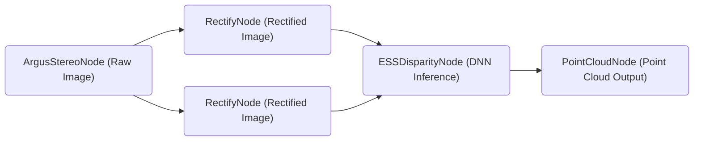

# Tutorial to Run NITROS-Accelerated Graph with Argus Camera



If you have an [Argus-compatible camera](https://github.com/NVIDIA-ISAAC-ROS/isaac_ros_argus_camera), you can also use the launch file provided in this package to start a fully NITROS-accelerated stereo disparity graph.

To start the graph, follow the steps below:

1. Follow the [Quickstart section](../README.md#quickstart) up to step 6 in the main README.
   
2. Outside the container, clone an additional repository required to run Argus-compatible camera under `~/workspaces/isaac_ros-dev/src`.

    ```bash
    cd ~/workspaces/isaac_ros-dev/src
    ```

    ```bash
    git clone https://github.com/NVIDIA-ISAAC-ROS/isaac_ros_argus_camera
    ```

3.  Inside the container, build and source the workspace:
    ```bash
    cd /workspaces/isaac_ros-dev && \
      colcon build && \
      source install/setup.bash
    ```
4.  (Optional) Run tests to verify complete and correct installation:
    ```bash
    colcon test --executor sequential
    ```

5. Launch ESS Disparity Node:
   ```bash
   ros2 launch isaac_ros_ess isaac_ros_argus_ess.launch.py engine_file_path:=/workspaces/isaac_ros-dev/src/isaac_ros_dnn_stereo_disparity/resources/ess.engine
